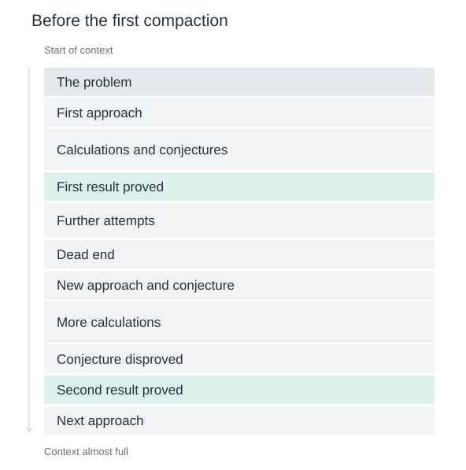
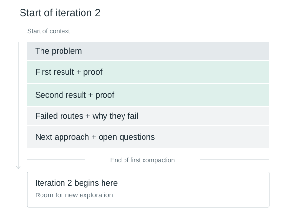
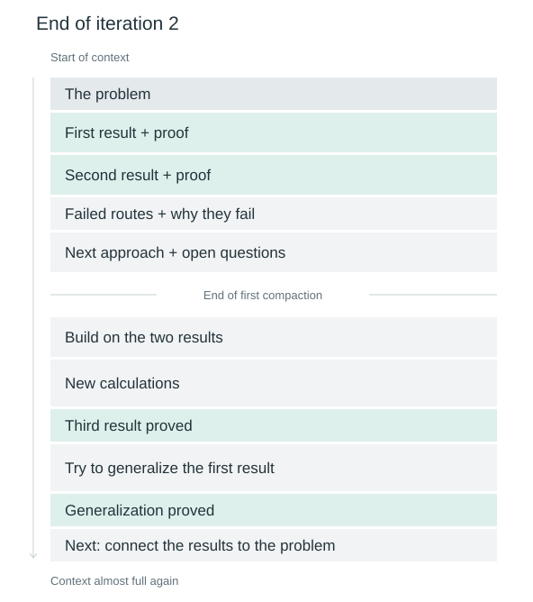
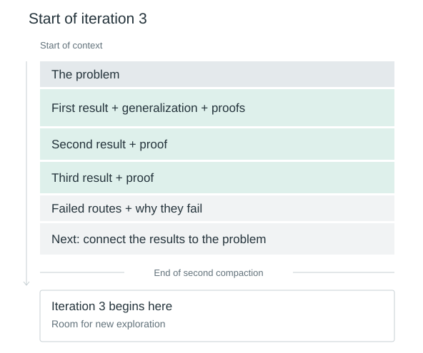

# Self-Evolving Agents

**Context as Agent-Owned State**

Lukas Brückner · Research proposal and reference implementation

## Abstract

An agent working on a long task accumulates attempts, evidence, corrections, and discoveries. Their order records how the work happened; it need not be the best arrangement for continuing it. This proposal gives the agent an `evolve` tool: a JavaScript transformation of the structured state behind its context. The agent can preserve existing content exactly, edit individual parts, and reorganize its working memory without generating the entire replacement as text. Repeated compactions can then consolidate discoveries into a maintained body of knowledge while making room for further exploration. We describe the interface, execution boundary, cache tradeoff, and a proposed evaluation of whether this control improves subsequent work. The accompanying implementation demonstrates the mechanism; its effect on model performance remains to be measured.

## 1. A context worth continuing from

Imagine an agent working on an open mathematical problem. The work takes hours or days. It tries approaches, performs calculations, finds connections, and abandons ideas. Some of that exploration produces results it can build on.

Initially, those results sit wherever they were discovered. A proof appears between calculations. A conjecture is disproved much later. Useful knowledge and the work that produced it accumulate together.



*The figures are schematic context snapshots. Green blocks mark established knowledge; heights do not represent token counts.*

The context is now almost full. Compaction must make room, but what should the agent keep?

For the next attempt, it needs the problem, its established results, and its current direction. Putting the results and their supporting proofs together after the problem gives further exploration a clear foundation. The reason an approach failed and the counterexample to a conjecture can remain useful too: they help avoid repeating the same mistake. Much of the surrounding scratch work can go.



The next attempt starts from what the agent has established. It can distinguish that foundation from what it is still testing, without reconstructing the distinction from scattered attempts and corrections.

Work continues below this foundation. The agent proves another result, then discovers that an earlier result can be generalized. The generalization initially appears at the end, where it was found, far from the result it extends.



The agent now incorporates the generalization into its first result, places the third result with the other established knowledge, and updates its next step. The calculations that led there no longer need to occupy the same space.



Across repeated cycles, exploration changes the knowledge the agent works from. Long-term knowledge and short-term work become different uses of the same context. The agent can retain exact proofs, revise its organization, and keep useful lessons from failed attempts. It can also develop working practices specific to the task. These changes live in its state; they do not change the model's weights.

This is one useful arrangement the agent could choose. The interface does not prescribe a fixed memory layout or require it to wait until the context is full.

## 2. Editing the state the model already sees

The harness already holds a structured representation of the conversation and tool results. The model sees a presentation of that data through its provider's input format. Giving the agent access to the underlying representation lets it describe changes to existing content.

The central distinction is between **the transcript**, which records what happened, and **working state**, which supplies the next model invocation. The transcript remains an independent record. Editing working state changes what the agent continues from.

Here, working state is an ordered array of messages, each containing typed parts:

```ts
type State = Message[];
type EvolveInput = { code: string };
```

The model calls `evolve` with JavaScript executed as the body of `function evolve(state: State): State`. For example:

```js
state[1].parts[0].text =
  "Plan: retry after 1, 2, and 4 seconds; return HTTP 401 immediately.";
return state;
```

This changes one text part while preserving the rest of the state. The agent generates the edit and the new sentence. It does not have to regenerate the user's request, earlier evidence, or every other message it wants to keep.

The same interface supports removing, moving, merging, or adding messages and parts. A transformation can use array operations, search existing text, select nested data, and construct new content. A summary is one possible output of this interface. A summary could also use the organization in the figures; the particular capability here is combining newly written material with direct preservation and transformation of existing data.

The [system suffix](src/system-message-suffix.md) introduces this relationship directly:

> What follows is your state.<br>
> You manage it yourself.<br>
> It is not the literal conversation the user sees.

It includes the state types and names the tool. The [tool description](src/mutation-tool.ts) explains the execution contract and compaction cost. Choices about what to remember and how to arrange it remain with the agent.

<details>
<summary>The supported state representation</summary>

The reference implementation uses the following JSON-compatible types. Objects inside tool results can hold structured evidence alongside text and files.

```ts
type Json = null | boolean | number | string | Json[] | { [key: string]: Json };

type TextPart = { type: "text"; text: string };
type ObjectPart = { type: "object"; data: Record<string, Json> };
type FilePart = { type: "file"; data: string; mimeType: string };
type ToolCallPart = {
  type: "toolCall";
  id: string;
  tool: string;
  args: Json;
};
type ToolResultContentPart = TextPart | ObjectPart | FilePart;
type ToolResultPart = {
  type: "toolResult";
  callId: string;
  content: ToolResultContentPart[];
};
type Message =
  | { role: "user"; parts: (TextPart | FilePart)[] }
  | { role: "model"; parts: (TextPart | FilePart | ToolCallPart)[] }
  | { role: "tool"; parts: ToolResultPart[] };
type State = Message[];
```

An adapter must preserve supported content, order, and tool relationships when mapping this state to model input. JSON roundtripping alone does not establish that property for a provider API. Nor does it establish that the model can reliably infer exact array indices from the presentation it sees. Those properties need adapter and model tests. Provider-only metadata, including opaque reasoning payloads, requires an extension with explicit preservation rules.

</details>

## 3. A surgical edit inside a tool result

Suppose the agent searches a codebase for where password resets expire. The search returns a large result containing many unrelated uses of expiry. Only the password-reset details matter for the next steps.

A small version of that situation contains these four matches:

| File | Returned text |
| --- | --- |
| `auth/reset.ts` | `const expiresAt = now + 15 * MINUTE;` |
| `cache/image.ts` | `const expiresAt = now + DAY;` |
| `auth/verify-reset.ts` | `if (token.expiresAt <= now) throw new ExpiredToken();` |
| `billing/quote.ts` | `const expiresAt = now + WEEK;` |

The agent can retain the two relevant entries exactly, including their paths and line numbers, and insert a note before the data in that same tool result:

```js
const result = state[2].parts[0];
const evidence = result.content[0];

evidence.data.matches = evidence.data.matches.filter(
  match => match.path.startsWith("auth/")
);

result.content.unshift({
  type: "text",
  text: "Memory edit by the agent: retained 2 of 4 matches verbatim. " +
        "Removed image-cache and billing expiry matches as unrelated to password resets."
});
return state;
```

The result now contains an agent-authored `TextPart` followed by the selected evidence in its `ObjectPart`. The tool call and result remain linked. The note makes clear that the result was edited after retrieval, while the original response remains in the transcript.

This works within a single message. It also avoids asking the model to reproduce exact evidence token by token. The note is optional and itself consumes space; in this tiny example it may outweigh the removed text. With a large result, the same operation can discard substantial unrelated data.

The runnable [selected-evidence example](examples/02-annotated-evidence/) demonstrates this edit with the note appended after the data. Two further examples [shorten an explanation while preserving the user's request](examples/01-selective-compression/) and [consolidate a task after a user correction](examples/03-current-task/).

## 4. The cost of an edit

Keeping useful content exactly avoids generating it again. Its position also matters under exact-prefix prompt caching: an edit near the beginning can prevent reuse of everything after it, even if much of that content remains unchanged.

We define **Compaction Cost** in this prefix model as:

```text
Compaction Cost = resultingInputTokens - reusablePrefixTokens
```

The prefix is computed over the complete serialized model input, including stable system instructions and tool definitions. A stable foundation may be reusable over many calls. Revising it can be expensive once and still be worthwhile if it improves the work that follows. This creates a tradeoff between the quality of the resulting context and the cost of changing it.

The [cost helper](src/cache-cost.ts) calculates the longest identical prefix of supplied token sequences. That is a reuse opportunity; actual cache hits depend on the provider, serialization, and cache availability. Generated edit code, execution time, and later model calls also contribute to total cost. The reference host has no provider tokenizer or measured cache usage, so its runtime receipt reports application success or failure; token accounting belongs in the integration.

## 5. Execution and integration

The agent proposes a transformation. The harness runs it against an isolated copy of the state, validates the output, and adopts it for the next invocation. A failed transformation leaves the original working state intact.

In the reference implementation, Node hosts [QuickJS compiled to WebAssembly](https://github.com/justjake/quickjs-emscripten). Generated code executes synchronously inside QuickJS and receives no host filesystem, network, or process functions. This lets the harness discard a candidate state without having to undo external actions performed by that code.

Defaults are 250 ms of execution time, a 16 MiB guest heap, a 256 KiB stack, 64 KiB of code, and 1 MiB each for serialized input and output. The runtime is disposed after each call. These are prototype limits; the interpreter is not an OS process boundary or a hard limit on total host memory.

The validator checks JSON-compatible data, message and part shapes, unique call IDs, and matching tool results. It checks representation, not whether a proof is correct or an omitted detail will matter later. Established knowledge in the example must come from the task's verification process.

The integration boundary is deliberately small:

1. Ordinary tool calls are completed and their results are made available to the model before it chooses a state edit.
2. A standalone `evolve` call is appended and the state is held stable while the transformation runs.
3. A valid replacement must retain that current call exactly. Earlier completed calls and results can be edited or removed together.
4. The harness appends a success result to the replacement, or an error result to the original state, and resumes generation from it.

The provided [boundary function](src/apply-mutation.ts) returns the resulting state. The integrating harness owns stream control, persistence, and committing the replacement. System instructions and tool definitions stay outside the mutable `State` in this prototype. The original transcript must also be stored independently.

## 6. Learning what to keep

The difficult decision is what future work will need. An agent may discard an exact constraint, mistake a conjecture for a result, or preserve an attractive explanation that is wrong. Repeated compaction can carry those mistakes forward just as it can carry useful knowledge.

The research question is whether control over state improves subsequent task performance and total resource use. A shorter or better-organized context is useful only insofar as it supports that work.

An evaluation should hold the base model, tasks, tools, context limit, and total budget fixed while comparing:

| Policy | How context is managed |
| --- | --- |
| Append-only | Events accumulate, with an explicit policy at the context limit. |
| Summary-based | A summary replaces history at a defined threshold. |
| Executable edits | The model chooses transformations of existing state. |
| Learned executable edits | A trained policy chooses those transformations. |

A further comparison with structured edit operations would test whether JavaScript's expressiveness is useful. Tasks should include exact constraints, later corrections, large tool results, and information that becomes relevant again. Longer tasks should require several compactions; shorter tasks can test whether reorganization helps even before the window fills.

Measure final task success, evidence and constraint preservation, rejected edits, total tokens, latency, and actual cache use. Include the cost of generating summaries or edit code. Evaluate outcomes independently of the appearance of the compacted state, retain intermediate states for inspection, and use repeated runs.

Reinforcement learning could train the choice of edits through feedback from continued work. Rewarding shorter contexts alone would encourage destructive forgetting. The objective must account for task outcomes as well as resource use. Assigning credit to an edit whose effect appears many steps later, and training a policy that changes its own future inputs, are central challenges.

## 7. Related work

[**MemGPT: Towards LLMs as Operating Systems**](https://arxiv.org/abs/2310.08560) develops model-directed management of memory tiers. It establishes a relevant foundation for agents managing what is available in their limited context.

[**AgentFold: Long-Horizon Web Agents with Proactive Context Management**](https://arxiv.org/abs/2510.24699) treats context as a workspace that the agent actively restructures, using both granular condensation and deeper consolidation. This overlaps closely with the motivation here.

[**Scaling Long-Horizon LLM Agent via Context-Folding**](https://arxiv.org/abs/2510.11967) lets agents branch into sub-trajectories and fold them into summaries. Its FoldGRPO framework trains decomposition and context management through reinforcement learning.

[**FoldAct: Efficient and Stable Context Folding for Long-Horizon Search Agents**](https://arxiv.org/abs/2512.22733) addresses training difficulties caused by summaries changing the agent's future observations. Those difficulties also matter for learning executable state edits.

The concrete proposal here is a code interface over typed messages and parts, combining exact preservation, edits within existing results, new annotations, and an explicit prefix-cost model. Its contribution is an interface and reference implementation to investigate. A comparative advantage over these approaches remains an empirical question.

## 8. Reference implementation

This repository contains the [state types](src/state.ts), [tool contract](src/mutation-tool.ts), [system suffix](src/system-message-suffix.md), [executor](src/execute-mutation.ts), [validator](src/validate-state.ts), and [integration boundary](src/apply-mutation.ts).

With Node.js 22 or later and pnpm 11.19.0:

```sh
pnpm install --frozen-lockfile
pnpm check
```

The checks type-check the code, exercise execution and validation, and reproduce three hand-written transformations from their `before.json`, `mutation.js`, and `after.json` files. They cover failure isolation, invalid outputs, resource limits, tool relationships, and prefix arithmetic. No model account is needed. `pnpm examples` runs only the transformations.

The mathematical sequence above illustrates a possible memory strategy. The executable fixtures establish that the edits can be applied correctly. This release includes neither a live provider adapter nor a trained policy, and reports no measurement of model performance. Supporting [design notes](docs/design.md), [evaluation details](docs/evaluation.md), and [related-work notes](docs/related-work.md) accompany the implementation.

---

By Lukas Brückner. Citation metadata is available in [CITATION.cff](CITATION.cff). The current rights notice is in [LICENSE](LICENSE).
