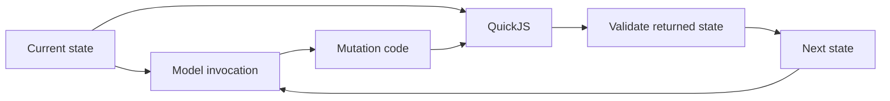

# Self-Mutating Agents

### Context as Agent-Owned State

An agent's context is its internal state. The conversation is one source of updates to that state, alongside tool results and the agent's own revisions.

In an append-only harness, that state grows in the order events happened. The agent inherits its earlier explanations, abandoned approaches, corrections, and raw tool output. Those records were useful when they were produced. Their original form may be less useful for the work ahead.

**What if the agent could directly edit the state it is working from?**

Self-Mutating Agents gives it a small interface: write a JavaScript function that receives the current structured state and returns its replacement. The agent can keep a user's exact words, shorten its own explanation, select evidence, add commentary, merge exchanges, or rearrange information. The user-visible conversation remains a separate record.

Compaction becomes one use of ordinary state management. The agent can also improve the arrangement of its memory while there is still room in the context window.

*A research proposal and runnable reference implementation by Lukas Brückner. The three examples are hand-written demonstrations. Model performance and RL training have not been evaluated here.*

## The mechanism

The memory presented to the model has a structured representation, `State = Message[]`. Each message contains typed parts. An adapter connects this representation to the model's input format, preserving supported content in both directions.

The system suffix tells the model that the context it sees is this state and that it manages it itself. The model calls `compact_memory` with the body of a JavaScript function:

```js
// Body of compact(state): State
state[1].parts[0].text = "Plan: retry after 1, 2, and 4 seconds; return HTTP 401 immediately.";
return state;
```

The harness runs the function against an isolated copy, validates the returned state, and uses it for the next model invocation. Everything the function leaves alone is preserved without being regenerated by the model.



This separates two decisions. The agent chooses the edit; the harness enforces the execution and representation rules. How aggressively to compress, where to add a note, and whether to preserve an exchange verbatim are choices the agent can learn.

## Three small examples

| Example | What changes | What it demonstrates |
| --- | --- | --- |
| [Preserve the request](examples/01-selective-compression/) | An assistant explanation becomes a one-sentence plan. The user's request stays exact. | Different parts can receive different treatment. |
| [Annotate selected evidence](examples/02-annotated-evidence/) | Four search matches become two exact matches plus an agent-written note. | Memory can contain both evidence and commentary about an edit. |
| [Consolidate the current task](examples/03-current-task/) | Three turns become one task description incorporating a correction. | The arrangement can move beyond conversation history. |

Each directory contains `before.json`, `mutation.js`, and `after.json`. The runner executes the transformation and checks the expected result. The snippets focus on memory edits; [the live boundary](src/apply-mutation.ts) additionally preserves the current mutation call and appends its receipt.

For example, a tool result can keep structured data in an `ObjectPart` and receive a sibling `TextPart`:

> Memory edit by the agent: retained 2 of 4 matches verbatim. Removed image-cache and billing expiry matches as unrelated to password resets.

The annotation is a choice illustrated by this example. The format does not require a fixed note-taking strategy.

## Editing has a cost

Under exact-prefix prompt caching, an early edit can force the following input to be processed again. We call the number of resulting input tokens beyond the reusable prefix **Compaction Cost**:

```text
Compaction Cost = resultingInputTokens - reusablePrefixTokens
```

This gives the agent a tradeoff: improve future context quality while accounting for the cost of the rewrite. Keeping useful content exactly can preserve a cache prefix as well as avoid generating it again. An expensive edit may still pay off across many later calls.

The [cost helper](src/cache-cost.ts) computes the ideal prefix model from supplied token sequences. Actual provider caching also depends on serialization, cache availability, and provider rules. The local examples report JSON bytes, not claimed token savings or cache hits. [Design details](docs/design.md#cache-accounting).

## Run it

Use Node.js 22 or later and pnpm 11.19.0.

```sh
pnpm install --frozen-lockfile
pnpm check
```

`pnpm check` type-checks the implementation, runs the tests, and verifies all three example transformations. No model account or API key is needed. To run only the examples, use `pnpm examples`.

This reference host is TypeScript running on Node, with QuickJS compiled to WebAssembly through [quickjs-emscripten](https://github.com/justjake/quickjs-emscripten). Generated mutation code runs inside QuickJS. It receives no host filesystem, network, or process functions.

## What is here

- [State types](src/state.ts), [tool definition](src/mutation-tool.ts), and [system suffix](src/system-message-suffix.md).
- [QuickJS executor](src/execute-mutation.ts), [state validator](src/validate-state.ts), and [mutation boundary](src/apply-mutation.ts).
- [Design](docs/design.md), including the mapping to model input and failure semantics.
- [Related work](docs/related-work.md), including substantial overlap with self-managed memory and context folding.
- [Evaluation proposal](docs/evaluation.md), including the role of reinforcement learning.

There is no live provider adapter or trained mutation policy in this release. The executable examples establish the mechanism. Whether models reliably choose beneficial edits is the research question.

## Learning to manage state

A prompt can explain the interface. Choosing what will matter later requires judgment about future work. RL could train this judgment by letting an agent mutate its state, continue a task, and receive feedback from task outcomes and resource use.

The proposed evaluation compares executable mutations with append-only context and summary-based compaction at matched budgets. It measures downstream performance as well as information loss, mutation overhead, and cache reuse. Better-looking summaries alone would not establish success.

## Attribution and status

Prepared as a private research draft. See [CITATION.cff](CITATION.cff) for attribution and [LICENSE](LICENSE) for the current rights notice. No claim of first discovery or measured superiority is made. Public release, licensing, and archival publication are separate next steps.
