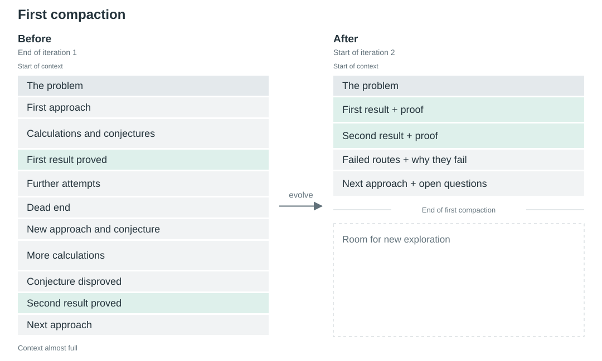
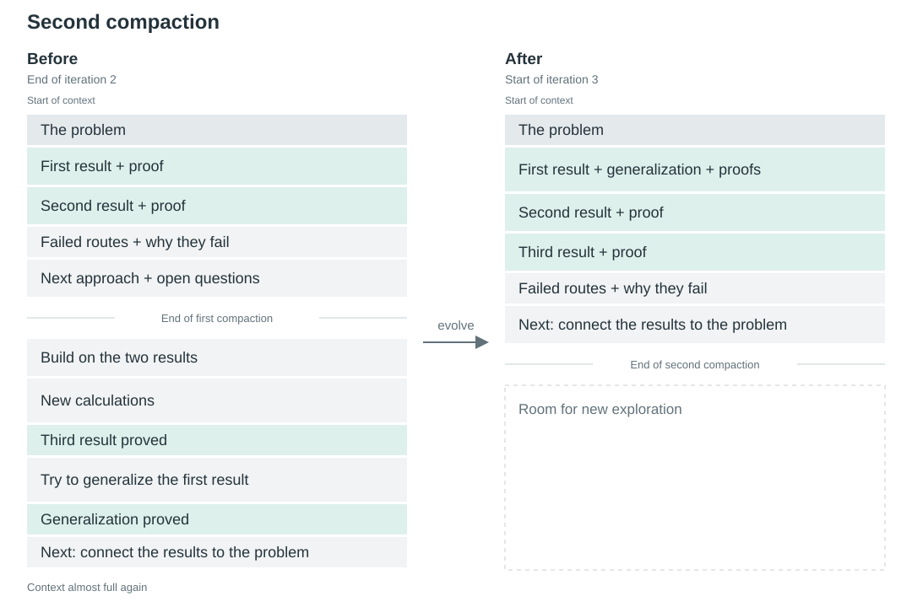

# Self-Evolving Agents

**A compaction mechanism for agents that manage their own memory**

Lukas Brückner · Concept paper and reference implementation

## Abstract

Long-running agents must compact their context while preserving information needed for further work. We propose treating that context as editable working memory. The agent writes code that locates and transforms existing messages and their parts, preserving selected material exactly and generating only the edits and new content. Repeated compactions can develop a stable, revisable core of knowledge and working practices. We propose training these decisions through their effects on task performance and resource use, accounting for both generated code and prompt-cache reuse. A reference implementation demonstrates execution and validation; reliable model use and benefits across long tasks remain to be evaluated.

## 1. Context and working memory

An agent chooses its next action from the context supplied to its model. This includes instructions, the user's task, and messages accumulated during the work. Responses and tool results add material to that context. The model's context window limits how much it can receive at once.

**Compaction** replaces some of this accumulated material with a smaller representation from which the agent can continue. A summary carries selected information forward in newly written text; original material can also be retained. What survives determines which evidence, constraints, and earlier conclusions remain available for subsequent decisions.

The complete record of the interaction is the **transcript**. In this proposal, the application keeps that record independently of the context used for continued work. We call the editable portion of that context the agent's **working memory**. Editing working memory changes what the agent works from while leaving the transcript intact.

We propose letting the agent choose edits within its working memory. It can keep an existing passage exactly, shorten another, remove irrelevant material, or bring related information together. The application applies these edits to the existing memory and supplies the result to the model.

Suppose the agent is investigating password-reset expiry. A search returns four code matches, each with a path, line number, and source text. Two concern password resets; the others concern image caching and billing. The agent wants to retain the two relevant records exactly and add a note explaining the selection. The rest of its memory can stay as it is.

## 2. Representing working memory

To apply that selection, the application needs a representation in which the search result and its individual records can be located and changed. The reference implementation stores working memory as an ordered array of messages. Each message has a role and an ordered list of parts. We call this structured working memory **State**. System instructions and tool definitions remain outside it.

Parts distinguish text, structured data, and files. In the search example, the records are structured data and the added note is text. The following types define these parts; `Json` specifies the values supported in structured data and tool arguments.

```ts
type Json = null | boolean | number | string | Json[] | { [key: string]: Json };

type TextPart = { type: "text"; text: string };
type ObjectPart = { type: "object"; data: Record<string, Json> };
type FilePart = { type: "file"; data: string; mimeType: string };
```

A tool call records the tool's name and arguments. Its identifier connects it to the corresponding result. A result can contain several parts, allowing the search records and the agent's note to coexist within it.

```ts
type ToolCallPart = {
  type: "toolCall";
  id: string;
  tool: string;
  args: Json;
};
type ToolResultContentPart = TextPart | ObjectPart | FilePart;
type ToolResultPart = {
  type: "toolResult";
  callId: string;
  content: ToolResultContentPart[];
};
```

Messages group these parts by their role. Together, they define the complete [State type](src/state.ts) used by the prototype.

```ts
type Message =
  | { role: "user"; parts: (TextPart | FilePart)[] }
  | { role: "model"; parts: (TextPart | FilePart | ToolCallPart)[] }
  | { role: "tool"; parts: ToolResultPart[] };

type State = Message[];
```

## 3. Editing State with code

The agent chooses an edit from the context it receives, while the application must apply that edit to the State it stores. The material the agent understands must therefore correspond to the material being edited. For the supported State, the proposal requires a **bijection** between State and its model-visible representation: a unique, reversible correspondence preserving content and structure.

The model-visible representation itself remains unspecified. Knowing the State types does not establish how their structure appears to the agent or which positions and identifiers it can directly recognize. The agent needs a way to express which material it means and have its location resolved in State.

Code provides that means. Given the State type definitions, the agent writes a JavaScript function that searches for and transforms the intended material. It can combine content searches, filters, and structural relationships. For example, the function can find a tool call through its search query and use the stored ID to locate the result. The agent need not know that ID in advance. Similarly, it can select the first image after a recognized passage without specifying an array index. The function resolves these locations when it runs.

The agent submits its function body through a tool named `evolve`. The application supplies the current State as its argument and uses the returned State as the replacement.

```ts
function evolve(state: State): State
```

Execution runs on a copy of State. The application checks the returned message structure and tool-call relationships before adopting it for continued generation. A failed execution or invalid result leaves the prior memory in place. These checks constrain execution and structural validity; the agent chooses the memory's content and organization.

For the four search matches, the function body locates the result, filters its records, and appends the note.

```js
const result = state
  .flatMap(message => message.parts)
  .find(part =>
    part.type === "toolResult" &&
    part.content.some(item =>
      item.type === "object" && Array.isArray(item.data.matches)
    )
  );

const evidence = result.content.find(
  item => item.type === "object" && Array.isArray(item.data.matches)
);

evidence.data.matches = evidence.data.matches.filter(
  match => /^auth\/.*reset\.ts$/.test(match.path)
);

result.content.push({
  type: "text",
  text: "Agent memory edit: kept 2/4 password-reset matches verbatim."
});
return state;
```

The retained records come directly from State. The model generates the selection code and the note, and everything outside the edit stays intact. The [runnable example](examples/02-annotated-evidence/) includes the input and output. The same operations can gather related material across messages or reorganize most of the memory.

## 4. Compaction cost

Writing an edit generates output tokens. Continuing from the edited State also requires processing the resulting model input. **Prompt caching** can reuse computation for an unchanged beginning of that input. Under an exact-prefix cache, changing an early token prevents reuse of the cached prefix beyond that position, even when later content remains identical.

The resulting input tokens outside the reusable prefix form the **Cache Cost**. To combine this with the cost of generating the `evolve` call, let `alpha` weight an output token relative to an uncached input token. For price-based weighting, `alpha` is the ratio of their respective token prices. **Compaction Cost** is then expressed in input-token equivalents.

```text
Cache Cost = resultingInputTokens - reusablePrefixTokens
Compaction Cost = alpha * evolveCallTokens + Cache Cost
```

The prefix must be measured over the complete serialized model input, including system instructions and tool definitions. An identical prefix is an opportunity for reuse; actual cache hits also depend on the provider's serialization and cache availability. Total task cost additionally includes cache reads, execution, and subsequent inference.

Preserving existing material saves the output tokens needed to reproduce it. Position also matters: a small edit near the end may cost less than an equally small edit near the beginning. This favors placing material expected to remain stable earlier in memory. A larger reorganization can still be worthwhile if it improves or reduces the cost of subsequent work.

## 5. Memory across repeated compactions

An agent continuing a task for hours or days can compact its memory many times. Each replacement becomes the basis for further work, whose results give the agent reasons to retain, refine, or correct that memory. Model weights remain fixed during this process.

Consider an agent exploring a mathematical problem. It tries approaches, tests conjectures, and proves two results. The proofs are scattered among the attempts that produced them. A compaction brings the results and their proofs together after the problem statement, retaining the reasons earlier approaches failed and the next direction to explore.



*Green blocks mark established knowledge. Block heights are schematic and do not represent token counts.*

Working from this memory, the agent proves a third result and generalizes the first. A further compaction incorporates the generalization, places the third result with the earlier proofs, and updates the next step. The proofs can be retained exactly as their organization changes.



The memory can also carry lessons about how to work. After unsuccessful proof attempts, the agent might retain a practice of searching for counterexamples earlier. If useful, that practice can continue to guide later attempts; contrary experience can prompt its revision.

Knowledge and working practices that remain useful across these cycles can form an increasingly stable, revisable core. This is the sense in which the agent is **self-evolving**: experience changes its persistent working memory, which in turn shapes its subsequent decisions.

## 6. Learning when and how to compact

The value of an edit depends on what happens afterward. Removing evidence may make the current input cheaper but prevent a later solution. Reorganizing a proof may cost tokens now and save substantial work later. Choosing edits therefore requires balancing task performance against costs across continued work.

We call the agent's strategy for choosing when to compact and what transformation to write its **compaction policy**. The `evolve` tool is available during the task; the application can also request a compaction as the context approaches its limit.

We propose training this policy with reinforcement learning using subsequent task outcomes and total resource use. Its actions are JavaScript transformations over State. Training can favor useful ways to select, organize, annotate, and revise memory, including frequent small edits, occasional larger reorganizations, or both. This trains the decisions that govern memory development; during an individual task, those decisions change State while model weights remain fixed.

## 7. Evaluation and related work

The research question is whether an agent can learn a sequence of compactions that improves task completion across long tasks at a worthwhile total cost. Execution alone establishes that edits can be applied. Evaluation must also test whether models reliably translate their understanding into edits of the intended State values and whether those edits help subsequent work.

Comparisons should use the same model, tasks, tools, context limit, and inference budget. Summary-based compaction should be allowed to organize knowledge and working practices. A comparison with fixed structured edit operations can test the contribution of JavaScript's expressiveness.

Tasks should make earlier evidence, corrections, and learned practices matter across several compactions. Measure task success, exact evidence and constraint preservation, repeated mistakes, tokens, latency, and actual cache use. Inspect whether retained lessons affect behavior and are corrected when experience contradicts them. Report training resources and cost weights separately. The [evaluation notes](docs/evaluation.md) describe the proposed experiments.

Existing approaches provide relevant comparisons. [Anthropic's compaction](https://platform.claude.com/docs/en/build-with-claude/compaction) produces a continuation summary; [OpenAI's compaction](https://developers.openai.com/api/docs/guides/compaction) returns an opaque encrypted compaction item and may retain original items. [MemGPT](https://arxiv.org/abs/2310.08560) manages memory tiers, and [AgentFold](https://arxiv.org/abs/2510.24699) restructures context at different scales. Google's [AnchoredContextCompactor](https://adk.dev/api-reference/typescript/classes/AnchoredContextCompactor.html) maintains a working state at the start of context. [Context-Folding and FoldGRPO](https://arxiv.org/abs/2510.11967) and [FoldAct](https://arxiv.org/abs/2512.22733) study learning to manage context.

## 8. Reference implementation

The prototype executes model-written JavaScript in QuickJS with bounded resources and no external access. It validates State and tool-call relationships before accepting a replacement. The [integration boundary](src/apply-mutation.ts) handles successful and failed edits. The [design notes](docs/design.md) specify execution limits, provider requirements, and transcript storage. The [cache helper](src/cache-cost.ts) estimates the reusable prefix from supplied token sequences.

The agent must understand that its memory may contain edits from previous compactions. The [system suffix](src/system-message-suffix.md) communicates the distinction between working memory and transcript.

> What follows is your state.<br>
> You manage it yourself.<br>
> It is not the literal conversation the user sees.

Three hand-written examples demonstrate [shortening an explanation](examples/01-selective-compression/), [selecting exact evidence](examples/02-annotated-evidence/), and [consolidating a corrected task](examples/03-current-task/). There is no live provider adapter, reinforcement-learning training, or measured agent-performance result in this release. Provider integration must establish the required correspondence and supply token and cache measurements.

With Node.js 22 or later and pnpm 11.19.0, run:

```sh
pnpm install --frozen-lockfile
pnpm check
```

The checks cover types, execution and validation, failure isolation, prefix arithmetic, and reproduction of the examples.

---

By Lukas Brückner. Citation metadata is available in [CITATION.cff](CITATION.cff). The current rights notice is in [LICENSE](LICENSE).
